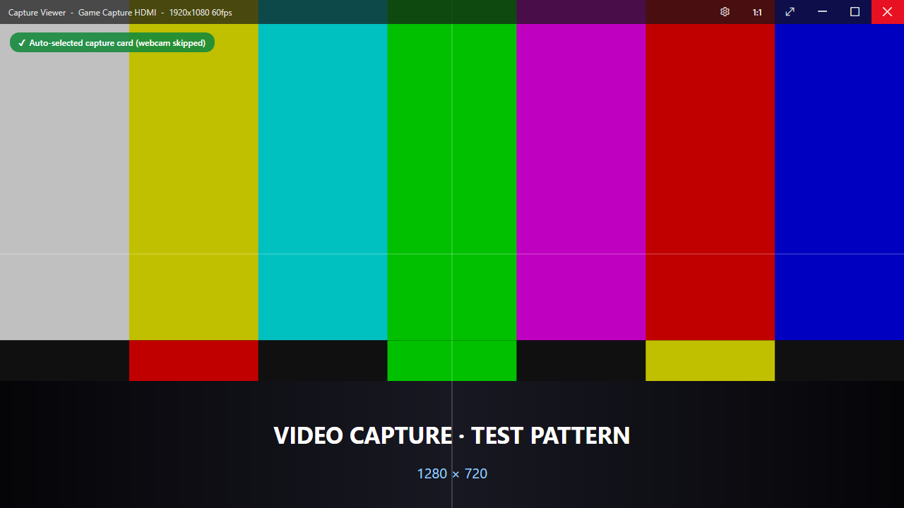
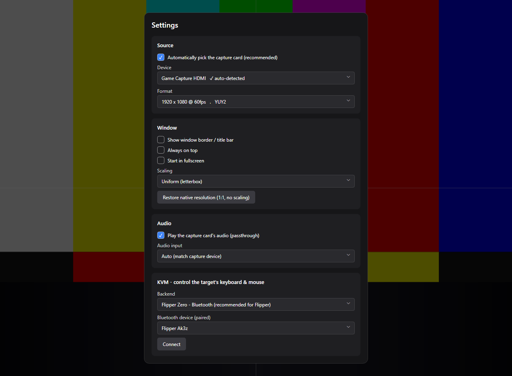
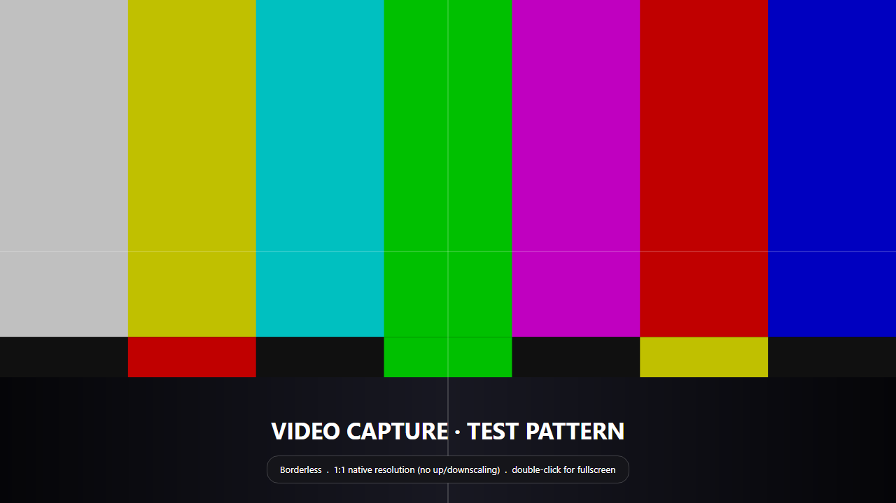

# Video Capture Card Viewer

A tiny, fast Windows app that shows a **video capture card** feed in a plain window — the thing
you actually want when you've been using OBS just to *look at* an HDMI source.

It launches borderless, **auto-detects the capture card** (and skips your webcam), maps the feed
**1:1 to native resolution**, and gets out of the way. Single self‑contained `.exe`, no install.



## Why

OBS, vendor capture utilities, and even VLC are heavy or fiddly for "just put my console / camera /
mini‑PC on screen in a window." The built‑in Windows Camera app grabs the *default* device (usually
your webcam), adds chrome, and won't do 1:1 native sizing. This does exactly one job, well.

## Features

- **Borderless by default** — clean, chromeless window. Toggle a normal border in Settings (or `Ctrl+B`).
- **SOTA window UX** — an auto‑hiding overlay bar keeps minimize / maximize / **fullscreen** / close
  and a settings gear, plus a right‑click menu and keyboard shortcuts. The cursor and chrome hide
  themselves in fullscreen.
- **Smart source pick** — heuristics score devices by name *and* capabilities to prefer an HDMI/USB
  capture card over a webcam. Always overridable in Settings or the right‑click menu.
- **Double‑click to toggle fullscreen.**
- **Restore native resolution (1:1)** — sizes the window so one source pixel = one screen pixel, no
  up/downscaling (`Ctrl+0`). Per‑monitor‑V2 DPI aware so 1:1 stays 1:1 on hi‑DPI displays.
- **Discoverable settings** — gear button, right‑click menu, and shortcuts; persisted to
  `%APPDATA%\VideoCaptureCardViewer\settings.json`.
- **Audio passthrough** — plays the capture card's audio through your default output (auto‑matched to
  the video device; toggle with `Ctrl+Shift+M`). WASAPI via NAudio; degrades to silent if unavailable.
- **Scaling modes** — Uniform (letterbox), UniformToFill, Fill, or None, in Settings.
- **Snapshot** — `Ctrl+S` saves the current frame as a PNG to `Pictures\Capture Viewer`.
- **Signal watchdog + hotplug** — clear "no device / signal lost" overlay, auto‑reconnects when the
  device returns, one‑click rescan, and a built‑in test pattern when nothing is connected.
- **Single instance** — a second launch won't fight over the capture device.
- **Optional KVM** — control the target machine's keyboard & mouse through the viewer (see below).




> Screenshots use a built‑in test pattern as stand‑in "screen content."

## Download

Grab `VideoCaptureCardViewer.exe` from the [latest release](../../releases/latest). It's a single
self‑contained file — no .NET install required. Just run it.

> The .exe is unsigned, so on first run Windows SmartScreen may show "Windows protected your PC."
> Click **More info → Run anyway**.

## Keyboard shortcuts

| Shortcut | Action |
|---|---|
| `F11` / double‑click | Toggle fullscreen |
| `Esc` | Exit fullscreen |
| `Ctrl+0` | Restore native resolution (1:1) |
| `Ctrl+B` | Toggle window border |
| `Ctrl+S` | Save snapshot (PNG) |
| `Ctrl+Shift+M` | Toggle audio passthrough |
| `Ctrl+,` | Open Settings |
| `Ctrl+M` | Minimize |
| `Scroll Lock` | Grab/release KVM control (when a KVM backend is connected) |

Borderless window: drag the picture to move it; drag the edges/corners to resize.

## KVM (control the target's keyboard & mouse)

You can drive the captured machine's keyboard and mouse from the viewer — handy for a headless
mini‑PC or a KVM‑over‑capture‑card setup.

**Important:** a regular PC/laptop **cannot emulate a USB keyboard by itself.** USB is host/device
asymmetric — your ports are host ports, and Windows ships no USB‑HID‑gadget stack. So KVM needs a
small piece of external HID hardware. Two backends are supported (plus a hardware‑free **Loopback**
for testing):

- **CH9329** (recommended, ~$10) — a USB‑serial→HID chip. The viewer drives it over a COM port; its
  HID side plugs into the target. Fully supported, including absolute mouse positioning. Set the
  module's baud to **115200** (the default) or pick its current rate in Settings.
- **Flipper Zero over Bluetooth** — the intended wireless path: **PC → Bluetooth → Flipper → USB →
  target**. Pair the Flipper, run the companion app in [`flipper-companion/`](flipper-companion/), then
  pick **Flipper Zero (Bluetooth)** in Settings. The app connects straight to the Flipper's serial
  GATT service (no COM bridge); the Flipper's USB presents HID to the target. A USB/serial (GPIO‑UART)
  fallback is also supported. The companion firmware is best‑effort against the official BLE‑serial API
  (verify on‑device) and the Flipper's USB mouse is relative‑only, so absolute positioning is approximated.

When connected: click the picture to take control (the cursor hides), press **Scroll Lock** to release.
Pointer position maps 1:1 to the captured resolution.

> Prefer a software KVM where you can install an agent on the other machine? Use
> [Input Leap](https://github.com/input-leap/input-leap) / Synergy / Mouse Without Borders instead —
> those share input over the network and don't need any HID hardware.

## Build from source

Requires the **.NET 10 SDK**.

```sh
git clone https://github.com/mayerwin/Video-Capture-Card-Viewer
cd Video-Capture-Card-Viewer
dotnet build -c Release
```

Produce the single self‑contained `.exe`:

```sh
dotnet publish -c Release -r win-x64 --self-contained true ^
  -p:PublishSingleFile=true -p:IncludeNativeLibrariesForSelfExtract=true ^
  -p:EnableCompressionInSingleFile=true
```

…or just run [`publish.cmd`](publish.cmd). The result lands in
`bin/Release/net10.0/win-x64/publish/VideoCaptureCardViewer.exe`.

Handy flags: `--demo` (show the test pattern), `--screenshots <dir>` (render the marketing PNGs).

## Tech

[Avalonia 12](https://avaloniaui.net) for the UI, [FlashCap](https://github.com/kekyo/FlashCap) for
capture (pure‑managed, single‑exe friendly), [NAudio](https://github.com/naudio/NAudio) for audio
passthrough, `System.IO.Ports` for the KVM serial link. .NET 10.

## License

[MIT](LICENSE).
